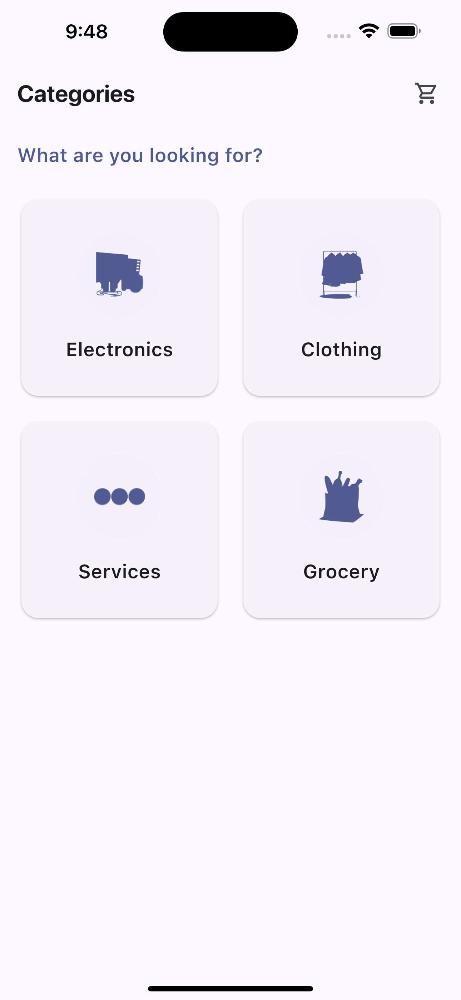
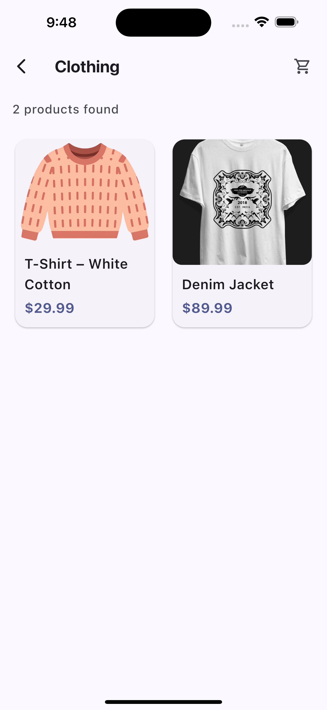
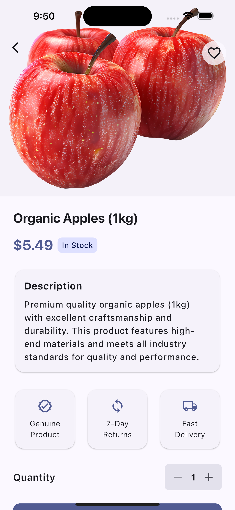
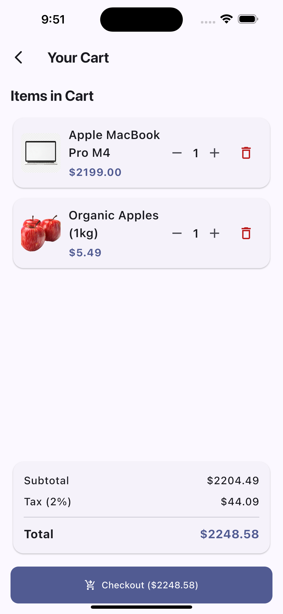
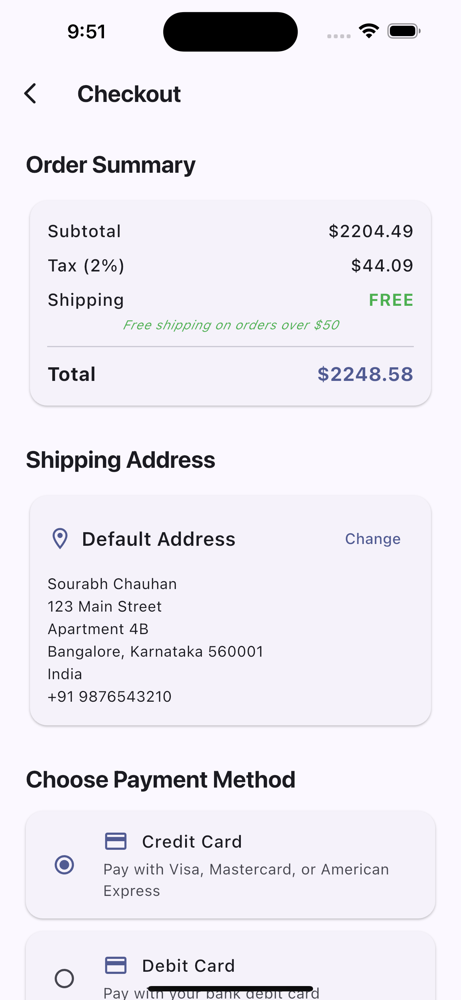

# Chauhan Shopping App

## Project Overview

Chauhan Shopping App is a modern Flutter-based e-commerce application designed to provide users with a seamless shopping experience. The app allows users to browse products across various categories, view detailed product information, manage a shopping cart, and complete purchases using multiple payment methods. The project aims to demonstrate best practices in Flutter development, state management, and Material 3 design, while serving as a robust foundation for scalable e-commerce solutions.

## Core Features Implemented

- **Category Browsing:** Users can explore products by categories such as Electronics, Clothing, Services, and Grocery.
- **Product Listing & Details:** Each category displays a grid of products. Users can view detailed information, images, and reviews for each product.
- **Cart Management:** Add, remove, and update product quantities in the cart. View a real-time order summary with tax and shipping calculations.
- **Checkout & Payment:** Multiple payment methods supported (Credit Card, Debit Card, Apple Pay). Secure checkout with order confirmation and cart clearing.
- **Modern UI/UX:** Material 3 design principles, responsive layouts, and consistent theming.
- **Review System:** Users can submit and view reviews for products.
- **Favorites:** Mark products as favorites for quick access.
- **Error Handling:** Graceful handling of missing images and empty states.

## Technology Stack Used

- **Flutter** (3.x): UI toolkit for building natively compiled applications for mobile, web, and desktop from a single codebase.
- **Dart**: Programming language for Flutter.
- **Provider**: State management solution for managing cart and app state.
- **Material 3**: Latest Material Design system for modern UI components.
- **Other Tools**: 
  - Android Studio/VS Code (IDE)
  - Git (version control)

## Setup Instructions

### Prerequisites

- [Flutter SDK](https://flutter.dev/docs/get-started/install) (3.x recommended)
- Dart SDK (comes with Flutter)
- Android Studio or VS Code (with Flutter and Dart plugins)
- Git

### Installation Steps

1. **Clone the repository:**
   ```sh
   git clone https://github.com/sourabh7838/chauhan_shopping_app
   cd chauhan_shopping_app
   ```

2. **Get dependencies:**
   ```sh
   flutter pub get
   ```

3. **(Optional) Update assets:**
   - Ensure all images are present in `assets/images/`.
   - If you add new images, update `pubspec.yaml` accordingly.

## How to Run the App

1. **Connect a device or start an emulator.**
2. **Run the app:**
   ```sh
   flutter run
   ```
3. **Build for release:**
   ```sh
   flutter build apk   # For Android
   flutter build ios   # For iOS
   ```

## Screenshots

| Home Screen | Category Screen | Product List | Product Detail | Cart | Checkout |
|-------------|----------------|--------------|----------------|------|----------|
|  |  |  |  |  |  |

## Project Structure

```
chauhan_shopping_app/
│
├── lib/
│   ├── main.dart                # App entry point, theme, and routing
│   ├── models/
│   │   └── item.dart            # Item model definition
│   ├── provider/
│   │   └── cart_provider.dart   # Cart state management (Provider)
│   ├── screens/
│   │   ├── home_screen.dart         # Home page with featured products and categories
│   │   ├── category_screen.dart     # Category grid
│   │   ├── product_list_screen.dart # Product grid for a category
│   │   ├── product_detail_screen.dart # Product details, reviews, and add to cart
│   │   ├── cart_screen.dart         # Cart management and summary
│   │   └── checkout_screen.dart     # Checkout and payment
│   └── widgets/
│       └── item_tile.dart           # Reusable product tile widget
│
├── assets/
│   └── images/                  # Product and category images
│
├── pubspec.yaml                 # Project configuration and dependencies
└── README.md                    # Project documentation (this file)
```

### Folder & File Purpose

- **lib/main.dart**: Initializes the app, sets up theming, and defines navigation routes.
- **lib/models/**: Contains data models (e.g., `Item`).
- **lib/provider/**: Contains state management logic (e.g., `CartProvider`).
- **lib/screens/**: Contains all UI screens/pages.
- **lib/widgets/**: Contains reusable UI components.
- **assets/images/**: Stores all image assets used in the app.
- **pubspec.yaml**: Lists dependencies and asset references.
- **README.md**: Project documentation.
